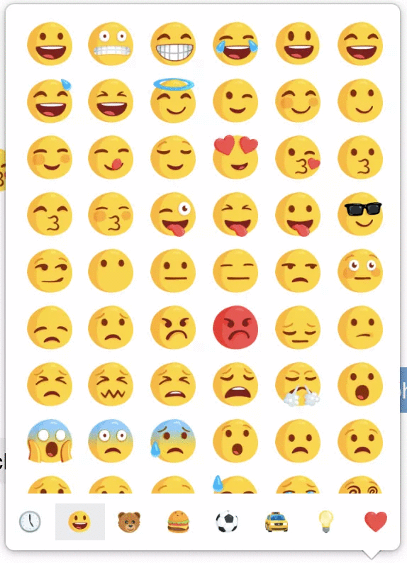

# messenger-emoji

This extension brings back the old (best) messenger emoji set seen here: https://emojipedia.org/messenger/

## Usage

1. Clone repo
2. Visit `chrome://extensions` in your browser (if you have not, enable developer mode)
3. Click `Load unpacked`
4. Choose the entire `messenger-emoji` folder
5. Enjoy the nicer emojis!

## Screenshots

